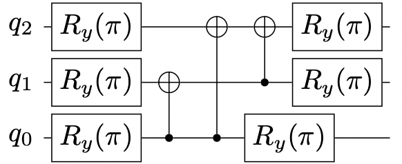
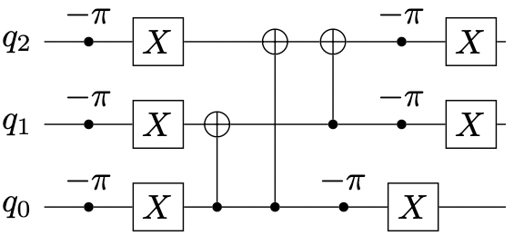
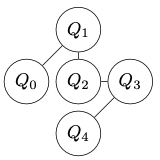
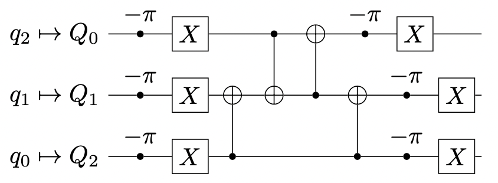

# qTUMbench: Benchmarking Software and Design Automation Tools for Quantum Computing

qTUMbench is a benchmarking suite with cross-layer support. This means, that the same benchmarking
algorithms are provided for different abstraction layers throught the quantum computing
software stack.

qTUMbench uses the structure proposed by the openQASM 3.0 consortia [1] and offers benchmarks
on four different abstraction layers:
1) Algorithm Layer
2) Target-independent Layer
3) Target-dependent Native Gates Layer
4) Target-dependent Mapped Layer


This is the algo layer description.



This is the target-independent layer description.

 

This is the target-dependent native gates layer description.



This is the target-dependent mapped layer description.

### Benchmark Selection
So far, the following benchmarks are implemented:
- Amplitude Estimation
- Iterative Amplitude Estimation
- GHZ State
- Graph State
- W State
- Grover's Algorithm
- Shor's Algorithm
- QAOA
- VQE
- Deutsch Jozsa
- HHL
- Quantum Walk
- Quantum Fourier Transformation
- Quantum Fourier Transformation Entangled
- Quantum Phase Estimation Exact
- Quantum Phase Estimation Inexact

Additionally, several quantum application algorithms are available.

### Native Gate-Set Support
So far, qTUMbench supports the following native gate-sets:
1) IBM-Q gate set with ['id', 'rz', 'sx', 'x', 'cx', 'reset']
2) Rigetti gate set with ['rx','rz','cz']

### Mapping Scheme Support
Currently, qTUMbench supports two mapping schemes:
1) Smallest Fitting Architecture Mapping: Maps quantum circuits to the smallest architecture with a sufficient number of physical qubits
2) Biggest Architecture Mapping: Always use the biggest available hardware architecture

#Structure
```
DAQCBench
│   README.md
│   <>.ipynb  
│
└───src
│   │   utils.py
│   │
│   └───benchmarks
│       │   ae.py
│       │   ...
│       │   wstate.py
│       └─── qiskit_application_finance
│       │       ...
│       └─── qiskit_application_ml
│       │       ...
│       └─── qiskit_application_nature
│       │       ...
│       └─── qiskit_application_optimization
│       │       ...
│
└───qasm_output
│
└───qpy_output
```

- src: Directory for  utils.py file and the source code of the benchmarks
- benchmarks: On top level, the benchmarks are included with one benchmark algorithms per file. 
  - Additionally, folders for each qiskit application module and their respective benchmarks are listed
- qasm_output: Here, the created benchmarks on the target-independent and -dependent layers will be created
- qpy_output: This is the folder for the created benchmarks on algorithm layer.

#Usage
To start the creation of all benchmarks, just run the jupyter notebook <>.ipynb file.

#References:
<details open>
<summary> [1] A.Cross et al., OpenQASM 3: A broader and deeper quantum assembly language, arXiv:2104.14722, 2021 </summary>

```bibtex
@misc{cross2021openqasm,
      title={OpenQASM 3: A broader and deeper quantum assembly language}, 
      author={Andrew W. Cross and Ali Javadi-Abhari and Thomas Alexander and Niel de Beaudrap and Lev S. Bishop and Steven Heidel and Colm A. Ryan and John Smolin and Jay M. Gambetta and Blake R. Johnson},
      year={2021},
      eprint={2104.14722},
      archivePrefix={arXiv},
      primaryClass={quant-ph}
}
```

</details>